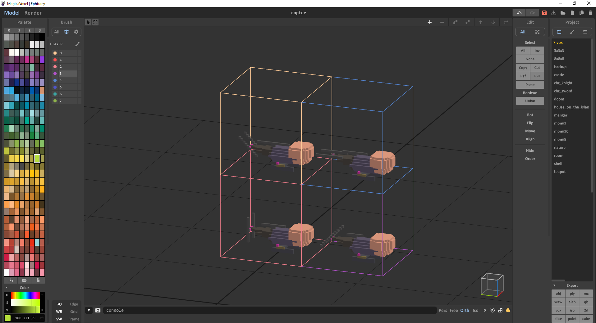
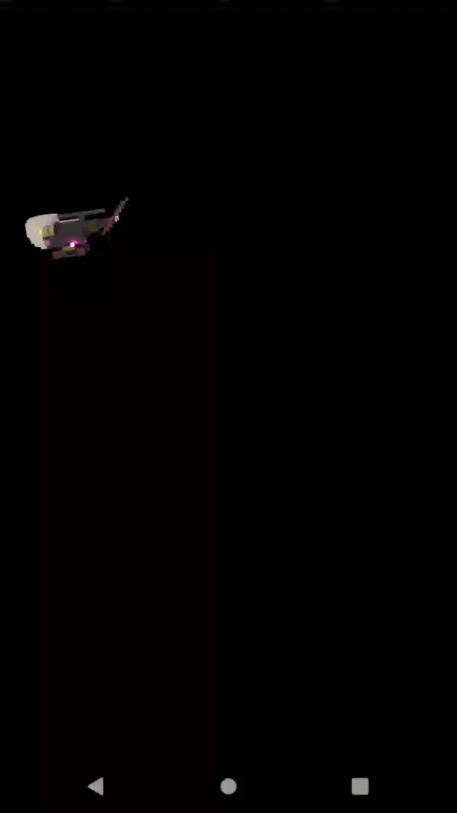
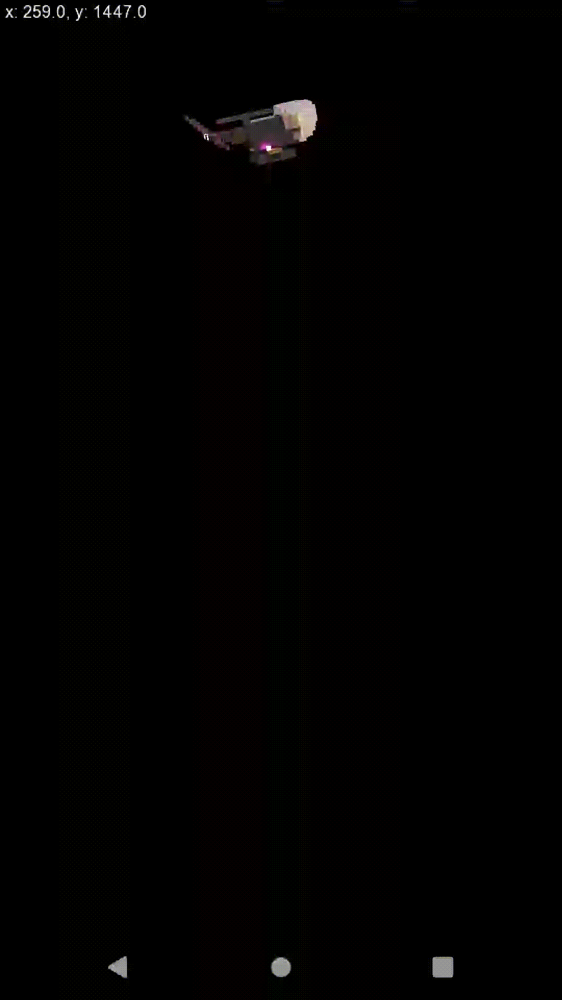

# Heli-game 🚁
A very simple libgdx-project used for an assignment in Software Architecture.

### Running the tasks
All tasks have been exported as executable jars and are present in the root of this project.

Simply clone this repository and run one of the following commands:

```shell
java -jar task-1.jar

java -jar task-2.jar

java -jar task-3.jar
```

(Requires > Java 8 installed)

### The helicopter model
The helicopter model was created using Magicavoxel (exported to 4 png files). 




The .vox file can be found [here (copter.vox)](copter.vox).

### Task 1
Create a helicopter that is bound to the edges of the screen (bounces off the screen sides when it collides).




### Task 2
The helicopter is bound to the edges, but may now also be touched and dragged to any position on the screen.

The current position (x,y) is now printed on screen.

Resumes flying after drag.




### Task 3
Allow multiple helicopters with different speeds to fly around on the screen.

If they collide, they should bounce off in different directions.

On render - if they initially collide, they should move to random positions until no helicopters collide.

